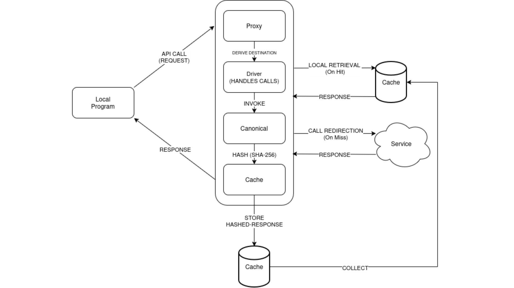

⚠️ WARNING: Pre-Alpha Status 
Middly is currently under active development. The architecture is subject to change, and it is not yet ready for use in developer environments. Do not rely on it until the official release.


# middly

A single-binary caching reverse proxy for HTTP APIs. Run it locally, point your
SDKs at `http://localhost:8080/<service>/...` instead of the real origin, and
external API responses get recorded the first time and replayed forever after
— deterministically, including for `POST` bodies.

it ensures:
- **Saving Tokens and API Costs:** By caching repetitive requests to expensive upstreams (like LLM providers), Middly intercepts duplicate prompts during the iterative testing phase.

- **Creating Deterministic Testing Environments:** Middly allows developers to replay cached responses, ensuring consistent and reproducible outputs. This removes network volatility, eliminates the burden of maintaining a live connection, and makes testing entirely predictable.

- **Zero-Bloat, Drop-in Deployment:** Compiled as a single, statically linked binary with no CGO dependencies, Middly drops cleanly into any local workspace or CI pipeline across OS architectures without complex toolchain requirements or heavy installations.



## Build & run

### Installation

1. Download and extract the latest release for your system.
2. Move the executable to your system's PATH to run it globally:

**Linux & macOS:**

```bash
chmod +x middly
sudo mv middly /usr/local/bin/
```
**Windows:**

Move middly.exe to a dedicated folder (e.g., C:\Tools) and add that folder to your System Environment Variables.

**Note:** macOS users may need to clear the quarantine flag: 
```bash
xattr -d com.apple.quarantine middly_darwin_arm64
```

Pure-Go SQLite (`modernc.org/sqlite`) — no CGO, single static binary.

## Usage examples


### Record-then-replay against OpenAI
```bash
middly --routes='<path>=<upstream_url>' --mode=<mode_type> --db=<database_file>

middly   # the default with (port:8080, db: cwd/cache.db, mode:record, routes: /openai, /anthropic,...)

# Point your client at the proxy:
export OPENAI_BASE_URL=http://localhost:8080/openai/v1
export OPENAI_API_KEY=sk-* #if the API key is needed! 

python my_script.py      # first run hits the real API and caches every call
python my_script.py      # second run is fully offline, sub-ms per call

# Open the dashboard at <http://localhost:8080/dashboard>.
```
### Bypass & Replay

```bash
middly --mode=replay          # never forwards a request to the upstream, play everything locally.
middly --mode=passthrough     # forwards every request, never reads/writes cache.
```

### CLI flags

| flag             | default     | meaning                                            |
|------------------|-------------|----------------------------------------------------|
| `--port`         | `8080`      | listen port                                        |
| `--db`           | `cache.db`  | SQLite file path                                   |
| `--mode`         | `record`    | `record` \| `replay` \| `passthrough`              |
| `--clear-cache`  | `false`     | wipe the cache on startup                          |
| `--verbose`      | `false`     | log every proxied request                          |
| `--ttl`          | `0` (off)   | expire entries older than this Go duration         |
| `--include-auth` | `false`     | hash the `Authorization` header (off = team-share) |
| `--routes`       | (built-ins) | `/prefix=https://host,...` overrides               |

`MIDDLY_MODE` env var sets the mode when `--mode` is left at its default.

### Default routes

| prefix       | target                       |
|--------------|------------------------------|
| `/openai`    | `https://api.openai.com`     |
| `/anthropic` | `https://api.anthropic.com`  |
| `/stripe`    | `https://api.stripe.com`     |
| `/weather`   | `https://api.weather.com`    |

Add or override with `--routes='/foo=https://example.com,/bar=https://other'`.

## Architecture

```
cmd/         CLI entry point — flag parsing, wiring, signal handling
canonical/   Deterministic request → SHA-256 hash
cache/       SQLite-backed response store (WAL, connection-pooled)
proxy/       httputil.ReverseProxy + cache lookup + capture-on-miss
dashboard/   HTMX UI at /dashboard
```

### canonicalization

`canonical.Canonicalize` produces a stable string of the form

```
METHOD\nNAMESPACE/path?sorted_query\nheader1: v\nheader2: v\nNORMALIZED_BODY
```

then hashes it with SHA-256. The hash is **deterministic across**:

- header order.
- query parameter order.
- JSON object key order — recursively.
- noisy/hop-by-hop headers.
- common cache-buster query params.

The `Authorization` header is **excluded by default** so a cache produced by
one developer can be replayed by another. Pass `--include-auth` if your
upstream's response actually depends on the credential (e.g. multi-tenant
billing data).

The `Namespace` (route prefix) is folded into the hash so `/openai/v1/x` and
`/stripe/v1/x` cannot collide.

### caching

`cache/cache.go` exposes `Get / Put / Clear / Count / Recent / Export / Import`
over a single SQLite file. Pragmas applied:

- `journal_mode=WAL` — concurrent readers + a single writer, no global lock
- `synchronous=NORMAL` — durable enough for a dev cache, much faster than FULL
- `busy_timeout=5000` — graceful contention handling

Connection pool: `MaxOpenConns=8, MaxIdleConns=8`.

### proxy / streaming

The proxy uses `httputil.ReverseProxy` with three hooks:

- **Director** — rewrites the URL to the upstream and strips
  `X-Forwarded-For`.
- **ModifyResponse** — wraps `resp.Body` with a tee-style `captureBody` that
  fills a `bytes.Buffer` as the client reads, then on EOF/Close fires a
  one-shot callback that persists the captured bytes to SQLite **in a
  goroutine** (so write latency to the cache never blocks the client).
- **FlushInterval = 100ms** — keeps SSE / chunked streams responsive.

This preserves status codes, headers, chunked encoding and trailers; the
cache stores only the decoded body and lets `net/http` re-encode on replay.

### modes

| mode          | cache read | cache write   | upstream call      |
|---------------|------------|---------------|--------------------|
| `record`      | yes        | yes (on miss) | on miss            |
| `replay`      | yes        | no            | never (miss → 502) |
| `passthrough` | no         | no            | always             |

### dashboard

`/dashboard` renders a small HTMX page that polls `/dashboard/stats` and
`/dashboard/recent` every second. No SPA framework, no build step — just a
single HTML template and HTMX from a CDN. Includes a `clear cache` button
(POST `/dashboard/clear`).

## Tests

```bash
middly --port=8080 --mode=replay
go test ./...
```

Covers:

- `canonical/` — header order, JSON key order, query order, blacklist,
  namespace isolation, auth handling
- `proxy/` — record-then-replay, replay miss → 502, passthrough never
  caches, namespace isolation across upstreams

## Project layout

```
cmd/main.go          CLI / wiring
canonical/           hashing
cache/               sqlite store
proxy/               reverse proxy + stats
dashboard/           HTMX UI + templates
```
